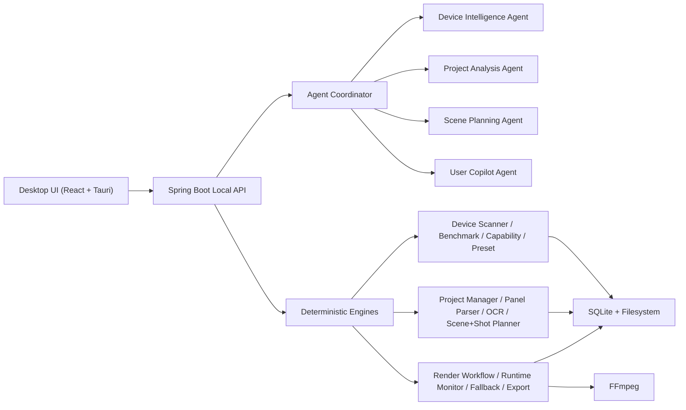

# High-Level Design

## System Intent

FramePilot AI turns comic assets into deterministic video outputs on the local machine. The architecture is designed around device awareness, resumable render execution, and strict guardrails so that explanation-oriented agents never override the rule or runtime engines.

## Core Principles

- Local-first execution and storage
- Device-aware planning before expensive work
- Stability-first render orchestration
- Agent-assisted explanation, engine-determined execution
- Resume and checkpoint at safe shot boundaries
- Cloud-independent operation

## Top-Level Runtime

## Layering

### Desktop layer

- Presents device, planning and render workflows
- Polls or streams render state
- Never decides the final preset, pipeline or fallback

### API and application layer

- Validates requests and enforces flow ordering
- Coordinates engines and agent advisories
- Aggregates results into UI-ready DTOs

### Domain and engine layer

- Owns rule-driven logic for capability scoring, pipeline selection, fallback and render progression
- Produces deterministic outputs from persisted state and runtime metrics

### Infrastructure layer

- OSHI for device and runtime metrics
- SQLite repositories
- Filesystem metadata and artifact export
- FFmpeg encoding and mux
- Tauri desktop shell packaging

## Guardrail Model

- Agents output advisory summaries, warnings and recommendations only
- Capability engine decides device tier
- Preset engine decides limits
- Pipeline selector decides initial pipeline
- Runtime monitor + fallback engine decide live degradation
- Render workflow service decides queueing, retries, checkpointing and lifecycle

## Delivery State

- Windows-first dev and packaging scripts are present
- End-to-end demo flow runs locally
- Render emits MP4, checkpoint JSON, runtime samples and auxiliary hook artifacts
- Tauri shell is prepared for bundled backend launch, with final native packaging still dependent on complete Windows SDK presence
